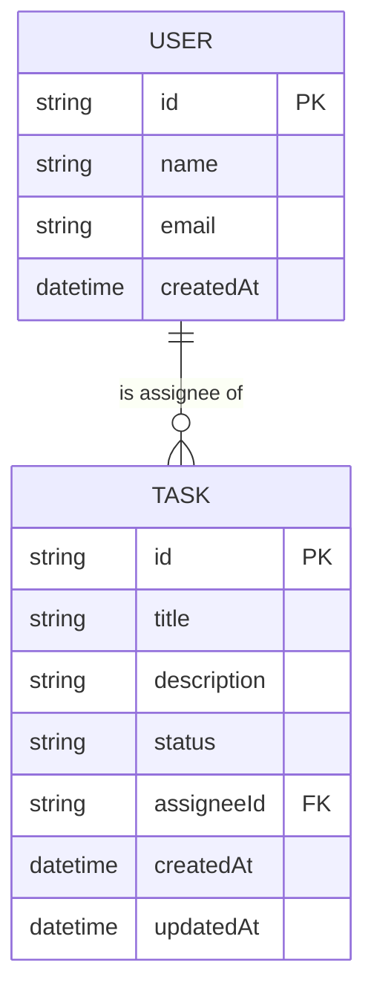

# Team Task Board

A small full-stack task tracker: NestJS + Prisma (SQLite) backend, React + Redux Toolkit + MUI frontend.

- [`backend/`](backend): REST API, Prisma schema/migrations, tests
- [`frontend/`](frontend): Kanban-style board UI

## Prerequisites

- Node.js 18+ and npm

## 1. Backend setup

```bash
cd backend
cp .env.example .env     # DATABASE_URL + PORT (no real secrets, defaults are fine)
npm install
npx prisma migrate dev   # creates dev.db and applies the schema
npx prisma db seed       # optional: seeds 3 users + 5 demo tasks
npm run start:dev
```

The API listens on `http://localhost:3001`. Config lives in `backend/.env` (`DATABASE_URL`, `PORT`).

## 2. Frontend setup

In a second terminal:

```bash
cd frontend
cp .env.example .env      # VITE_API_URL, defaults to http://localhost:3001
npm install
npm run dev
```

The app runs on `http://localhost:5173` and talks to the backend at the URL in `frontend/.env` (`VITE_API_URL`, defaults to `http://localhost:3001`). Make sure the backend is running first.

## Running tests (backend)

```bash
cd backend
npm test        # unit tests (TasksService)
npm run test:e2e  # e2e tests against a real Nest app + SQLite DB
```

The e2e suite creates and deletes its own task, so it's safe to run against the seeded dev database.

## API

| Method | Path                | Description                              |
| ------ | -------------------- | ----------------------------------------- |
| GET    | `/tasks`             | List tasks, optional `?status=&assigneeId=` filters (`assigneeId=unassigned` for tasks with no assignee) |
| GET    | `/tasks/:id`         | Get one task                              |
| POST   | `/tasks`              | Create a task                             |
| PATCH  | `/tasks/:id`          | Update any task fields                    |
| PATCH  | `/tasks/:id/status`   | Update just the status (used by the UI)   |
| DELETE | `/tasks/:id`          | Delete a task                             |
| GET    | `/users`              | List users (for the assignee dropdown)    |

## Data model & ER diagram

`Task` has an optional many-to-one relationship to `User` via `assigneeId`: many tasks can share one assignee, and a task can be unassigned (`assigneeId: null`). Deleting a user sets their tasks' `assigneeId` to `null` rather than deleting the tasks.



## Decisions & Tradeoffs

### Decisions

- **Nullable assignee relation:** modeled `Task` → `User` as a nullable 1:many relation (`onDelete: SetNull`) so "unassigned" is a first-class state rather than a sentinel value.
- **SQLite via Prisma:** zero-setup local dev; the schema is provider-agnostic enough to swap to Postgres by changing the `datasource` block.
- **Dedicated status endpoint:** `PATCH /tasks/:id/status` is separate from the general `PATCH /tasks/:id`, keeping the board's primary interaction (move a task to a new column) explicit and cheap.
- **Status dropdown over drag-and-drop:** chose a per-card status dropdown for moving tasks between columns instead of a drag-and-drop kanban interaction.
- **`createAsyncThunk` over RTK Query:** the CRUD surface is small, so thunks keep the data flow easy to follow without a second caching layer to reason about.
- **Server-side filtering, client-side grouping:** filtering by status/assignee happens server-side via query params, while grouping into columns happens client-side from the fetched list.
- **Pinned dependency versions:** `npm install prisma`/`@mui/material` pulled in Prisma 7 and MUI 9 by default (their current `latest` tags), both of which introduced breaking changes (Prisma's new config-file/generated-client format, MUI 9's stricter component typings). Pinned both back to their previous stable majors (Prisma 6, MUI 7).

### Tradeoffs

- **No authentication:** skipped per the spec's single-user assumption; anyone with API access can act as any user.
- **No edit-task dialog:** the general `PATCH /tasks/:id` endpoint supports editing any field via the API, but the UI only exposes status changes, not editing title/description/assignee after creation.
- **No optimistic UI updates:** status changes wait for the API round trip rather than updating the UI immediately, so there's a brief lag on slower connections.
- **No drag-and-drop:** the dropdown-based status control is less discoverable than dragging cards between columns, traded for lower implementation time and complexity.
- **No CI/CD pipeline:** there's no GitHub Actions (or similar) workflow to run tests on push/PR or to deploy the app. Tests are run manually with `npm test` / `npm run test:e2e`; this would be a natural next step if the project grew beyond a take-home.
- **No API docs (Swagger/OpenAPI):** the API is documented in this README's table instead of a generated `/api` docs page (`@nestjs/swagger`); fine for a handful of endpoints, but would be worth adding if the API grew.
- **SQLite instead of Postgres:** faster to set up locally but not representative of a production deployment target; would need Postgres + Docker Compose for closer prod parity.

## Time spent

~3 hours 15 minutes.
